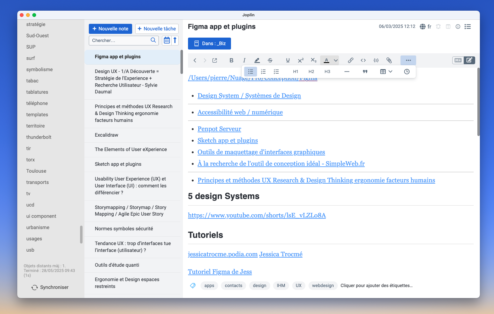
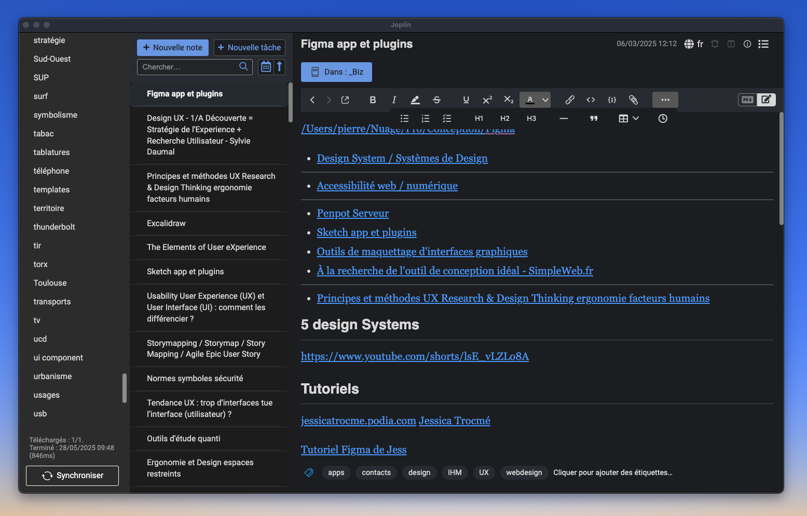

# 🎨 Joplin macOS Theme

Un thème personnalisable pour l’application [Joplin](https://joplinapp.org), inspiré de l’esthétique de macOS, conçu pour offrir une interface cohérente, élégante et confortable au quotidien.

💡 **Adaptatif** : ce thème s’ajuste automatiquement au mode clair ou sombre de votre système d’exploitation.

📦 Ce dépôt contient :
- `userchrome.css` : pour styler l’interface de l’application Joplin (barres, listes, menus…)
- `userstyle.css` : pour styler le rendu Markdown (contenu des notes)
- Des captures d’écran (dans le dossier `screenshots/`) pour voir le rendu

---

## 📸 Aperçu

### 🌞 Mode clair

### 🌙 Mode sombre

---

## ✅ Objectifs du thème

- Reproduire une expérience proche des applications macOS natives
- Améliorer la lisibilité et le contraste dans toutes les sections
- Adapter automatiquement le style au mode clair/sombre de l’OS
- Offrir une base facilement personnalisable pour les utilisateurs avancés

---

## 🚀 Installation

> Ce thème fonctionne avec la version **Desktop** de Joplin (macOS, Windows, Linux)

1. Ouvrir Joplin
2. Aller dans **Paramètres** :
   - Sur macOS : `Joplin > Réglages`
   - Sur Windows/Linux : `Outils > Options`
3. Aller dans l’onglet **Apparence**
4. Cliquer sur **"Montrer les options avancées"** (en bas de l’écran)
5. Ouvrir **Feuille de style pour le rendu Markdown**
   - Remplacer le contenu par celui de `userstyle.css` (si utilisé)
6. Ouvrir **Feuille de style pour l'application Joplin**
   - Remplacer le contenu par celui de `userchrome.css`
7. Redémarrer Joplin pour appliquer le thème

> 📝 Si tu veux uniquement changer l’interface (menus, listes, etc.), seul `userchrome.css` est nécessaire.

## Auteur

Pierre Lannes  
GitHub : [PierreLga456](https://github.com/PierreLga456)  
Avec l'aimable aide de ChatGPT

## Licence

MIT
